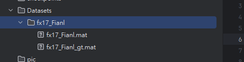

## 下載資料
[連結](https://drive.google.com/drive/folders/1ItmLacDowaWgg9jxWqMO5reXfzAPLLJn?usp=sharing)
### 下載到Datasets資料夾內

## 安裝環境
   ```shell
   conda env create -f environment.yml
   ```
### 3.進入TRAINING 環境
 ```shell
  conda activate TRAINING
 ```

## 模型

目前，此工具實現了來自 [scikit-learn](http://scikit-learn.org/stable/) 庫的幾種支持向量機 (SVM) 變體，以及使用 PyTorch 實現的多種最先進的深度網絡模型：
  * SVM（線性、RBF 和多項式核函數，使用網格搜索）
  * SGD（使用隨機梯度下降進行快速優化的線性 SVM）
  * 基線神經網絡（4 層全連接層，帶有 dropout）
  * 一維卷積神經網絡 (1D CNN)（[針對高光譜圖像分類的深度卷積神經網絡，Hu 等人，Journal of Sensors 2015](https://www.hindawi.com/journals/js/2015/258619/)）
  * 半監督式 1D CNN（[高光譜圖像的自編碼器可視化，Boulch 等人，GRETSI 2017](https://delta-onera.github.io/publication/2017-GRETSI)）
  * 二維卷積神經網絡 (2D CNN)（[高光譜 CNN 用於圖像分類與波段選擇，應用於人臉識別，Sharma 等人，技術報告 2018](https://lirias.kuleuven.be/bitstream/123456789/566754/1/4166_final.pdf)）
  * 半監督式 2D CNN（[半監督式卷積神經網絡用於高光譜圖像分類，Liu 等人，Remote Sensing Letters 2017](https://www.tandfonline.com/doi/abs/10.1080/2150704X.2017.1331053)）
  * 三維卷積神經網絡 (3D CNN)（[基於 3D 深度學習的遙感圖像分類，Hamida 等人，TGRS 2018](https://ieeexplore.ieee.org/stamp/stamp.jsp?arnumber=8344565)）
  * 三維全卷積神經網絡 (3D FCN)（[基於上下文深度 CNN 的高光譜分類，Lee 和 Kwon，IGARSS 2016](https://arxiv.org/abs/1604.03519)）
  * 多尺度 3D CNN（[基於多尺度 3D 深度卷積神經網絡的高光譜圖像分類，He 等人，ICIP 2017](https://ieeexplore.ieee.org/document/8297014/)）

### 添加新模型

要添加自定義深度網絡，可以通過修改 `models.py` 文件來實現。這需要創建一個新的類來描述自定義深度網絡，並修改 `get_model` 函數以納入新模型。

## 使用方法

啟動 Visdom 服務器：
`python -m visdom.server`
然後訪問 [`http://localhost:8097`](http://localhost:8097) 來查看可視化結果。  
接著運行腳本 `main.py`。

最常用的參數：
  * `--model`：指定模型（例如 'svm', 'nn', 'hamida', 'lee', 'chen', 'li'）
  * `--dataset`：指定數據集（例如 'PaviaC', 'PaviaU', 'IndianPines', 'KSC', 'Botswana'）
  * `--cuda`：使用 GPU 運行神經網絡。如果未指定此選項，工具將自動切換到 CPU。

還有更多參數可以更精細地控制工具的行為。請執行 `python main.py -h` 獲取詳細信息。

範例:

* RTX 2080
  * `python main.py --model hamida --dataset fx17_Fianl --patch_size 5 --epoch 3 --cuda 0`

* RTX 3090ti
  * `python main.py --model hamida --dataset fx17_Fianl --patch_size 5 --epoch 2 --cuda 0`
    2024_12_18_17_50_24_epoch2_0.98.pth結果較好

>記得訓練的時候 多執行幾次 每台機器都有不同的結果